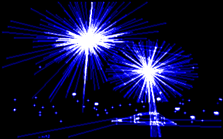

# Crystal Pixels - modern version



[](https://github.com/Enet4/cryxtels/actions/workflows/ci.yml)

Crystal Pixels (Cryxtels in short) is a simulator game where you live in a dark and cold microcosm. It was imagined and brought to life by Alessandro Ghignola, who is mostly known for developing the space simulator game Noctis. You can fly to small spaces called pixels, with several other features, such as walking around them and creating pixels and objects.

Cryxtels was initially an MS-DOS game. Later on, a port was developed in order to be playable in modern systems such as Linux. This repository contains the latest development versions of this port.

At the moment, this version is known to work on Windows (8+) and Linux.

## Building

Building this project requires:

- A C++ compiler supporting standard C++11.
- CMake 3.10 or greater is required.
- The SDL 2 development library should be installed in the system,
  either via a package manager in your system
  or through [vcpkg](https://github.com/microsoft/vcpkg).

Run `cmake` to generate the project scaffold
(usually GNU Makefiles on Linux platforms),
then build the project.

On Linux:

```sh
mkdir build
cmake -B build -DCMAKE_BUILD_TYPE=Release
cmake --build build --config Release
```

On Windows using vcpkg:

```bat
vcpkg install sdl2:x86-windows
mkdir build
cmake -B build -DCMAKE_BUILD_TYPE=Release
cmake --build build --config Release -A win32 -DCMAKE_TOOLCHAIN_FILE=C:/path/to/vcpkg/scripts/buildsystems/vcpkg.cmake
```

The output is the executable file `cryxtels`.

### Web version

Building the Web version of Crystal Pixels
is currently done with a different mechanism.
Install Emscripten, then:

1. Copy the file PIXELS.DEF from the `bin/` folder into the project root
2. Run the command [build-wasm.sh](build-wasm.sh)

## Installing

Place the compiled executable in the bin directory.
Symlinks for running cryxtels in the console can be made manually.

## Running

Before you start playing, please read *crystal pixels.txt* and *readme new.txt* to understand how to play.
To run the game, execute `cryxtels` while ensuring that
PIXELS.DEF and all .ATM files are in your current working directory
(these are all available here in the [bin](bin) folder).
Simple Directmedia Library version 2 must be installed in the system.

## License

GNU Public License v3

This program is free software: you can redistribute it and/or modify
it under the terms of the GNU General Public License as published by
the Free Software Foundation, either version 3 of the License, or
(at your option) any later version.

This program is distributed in the hope that it will be useful,
but WITHOUT ANY WARRANTY; without even the implied warranty of
MERCHANTABILITY or FITNESS FOR A PARTICULAR PURPOSE.  See the
GNU General Public License for more details.

You should have received a copy of the GNU General Public License
along with this program.  If not, see <http://www.gnu.org/licenses/>.
